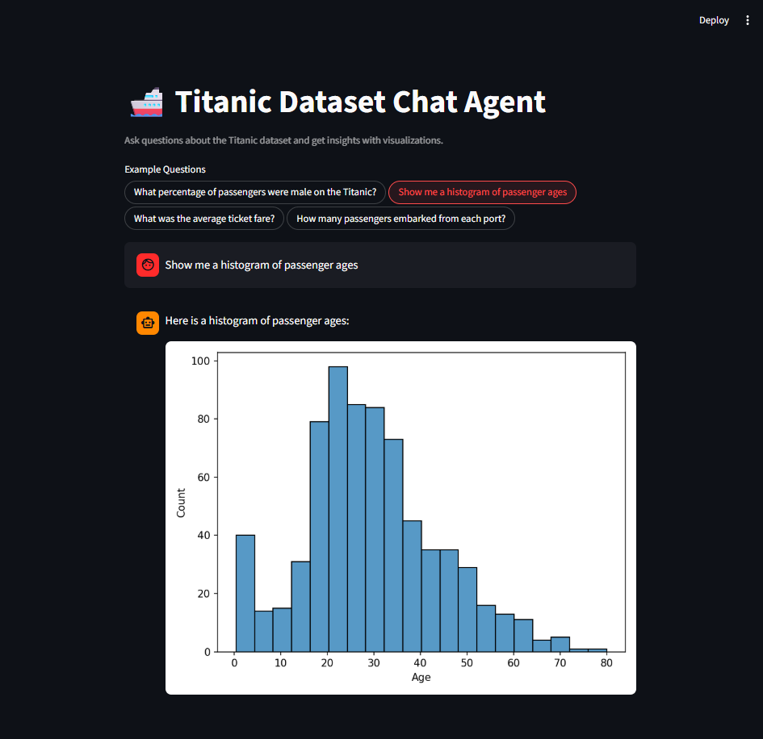
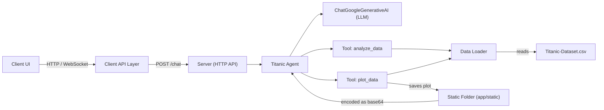

# Titanic Chat Agent

A conversational agent for exploring the Titanic dataset. This repository contains a lightweight client UI and a Python server that hosts a small agent, dataset loaders, and API endpoints for chat-based interaction and data exploration.

**Live demo**

- Client (Streamlit Cloud): https://titanic-chat-agent-app.streamlit.app/
- Backend (FastAPI on Render): https://titanic-chat-agent-kyd2.onrender.com/

> **Note (Render free tier / cold start):** The backend is deployed on Render's free tier and may experience a cold start — the first request after idle can take a few seconds. Please allow a moment on first load while the service starts.

---

**Client preview**



---

**Key points**

- **Client:** Simple chat UI and API client located in [client/app.py](client/app.py) and [client/components/chat_ui.py](client/components/chat_ui.py).
- **Server:** FastAPI-based (or minimal HTTP) server with agent logic and data services under [server/app](server/app).
- **Data:** Titanic dataset at [server/app/data/Titanic-Dataset.csv](server/app/data/Titanic-Dataset.csv).

---

**Project Architecture**



---

**Requirements & Compatibility**

- Python 3.10+ recommended.
- Server dependencies are listed in [server/requirements.txt](server/requirements.txt).
- Client uses a lightweight Python UI; see [client/pyproject.toml](client/pyproject.toml) for packaging info.

**Quickstart (local, development)**

1. Clone the repo and change into the project directory:

```bash
git clone git@github.com:Pritam-25/titanic-chat-agent.git
cd titanic-chat-agent
```

2. Create and activate a virtual environment (PowerShell example):

- Install client dependencies:

```powershell
 cd client
 uv run
 .\.venv\Scripts\activate
```

- Install server dependencies:

```powershell
 cd server
 uv run
 .\.venv\Scripts\activate
```

3. Run the server (development) — using `uvicorn`:

note: make sure virtual environment (server) is enabled

```powershell
cd server
uvicorn app.app:app --reload
```

6. Run the client UI (in a separate terminal):

note: make sure virtual environment (server) is enabled

```powershell
cd client
streamlit run app.py
```

Then open the client UI in the browser (Streamlit usually opens `http://localhost:8501`) and use the chat to interact with the agent.

**API & Endpoints**

- Chat endpoint: POST to `/api/v1/chat` (see [server/app/api/v1/endpoints/chat.py](server/app/api/v1/endpoints/chat.py)).
- Router setup: [server/app/api/v1/router.py](server/app/api/v1/router.py).

Typical request JSON:

```json
{
  "message": "Show survival rate by class",
}
```

Typical response JSON:

```json
{
  "answer": "Here are the survival rates...",
  "image_base64": {
    /* optional plot if avilable */
  }
}
```

---

**Contact:** For questions, email [maityp394@gmail.com](mailto:maityp394@gmail.com).
